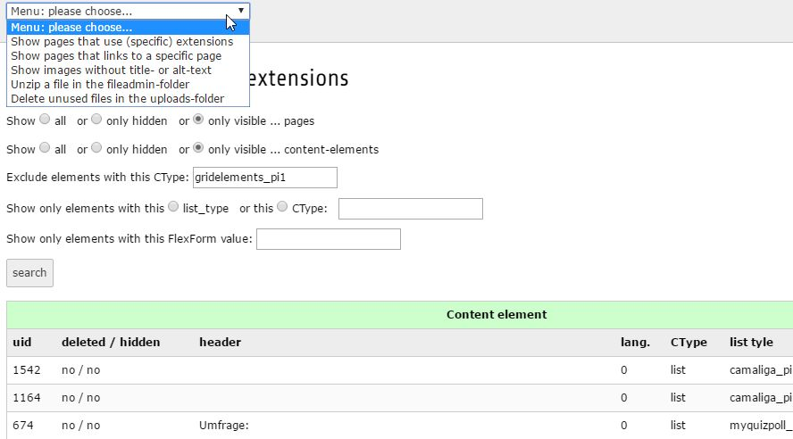

.. ==================================================
.. FOR YOUR INFORMATION
.. --------------------------------------------------
.. -*- coding: utf-8 -*- with BOM.

.. include:: ../Includes.txt

.. _introduction:

Introduction
============

.. _what-it-does:

What does it do?
----------------

This extension provides some useful tools in the “Admin tools” section in the backend of TYPO3. Currently it contains 5 tools for extensions, files, images and links.

Tool 1: shows you all pages where you use extensions. You can see where you use which extension. You can search for non-extensions too, e.g. if you set Ctype='mailform'.

Tool 2: you can extract an uploaded zip-file in the fileadmin-folder. Useful if you have no SSH connection.

Tool 3: helps you to delete unused files. Go to “Admin tools” → DB check” → “Database Relations” to find files which you can delete. This tool helps you to delete these files.

Tool 4: helps you to find pages that link to another page. You can find any content element with a link to a specific page.

Tool 5: helps you to find images with no title- oder alternative-text. This tool can set that values for you too.

.. _screenshots:

Screenshots
-----------

One screenshot from the backend module.

.. _made-in:

Made in...
----------

Thanks to the
`fixpunkt werbeagentur gmbh, Bonn <https://www.fixpunkt.com/webentwicklung/typo3/>`_
for giving me the possibility to realize
`this extension <https://www.fixpunkt.com/webentwicklung/typo3/typo3-extensions/>`_
and share it with the TYPO3 community.
